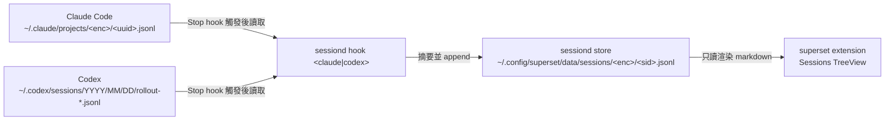

# Session JSONL 格式索引 (Session JSONL Formats)

`sessiond` 讀兩種上游 transcript，寫出一種自有 store。三種都是 JSONL，但語意與生命週期完全不同，本目錄一格式一檔。

| 檔案 | 格式 | 誰寫的 | sessiond 角色 |
| --- | --- | --- | --- |
| [`claude-transcript.md`](claude-transcript.md) | Claude Code transcript | Claude Code CLI | 只讀 (read-only) |
| [`codex-rollout.md`](codex-rollout.md) | Codex rollout | Codex CLI | 只讀 (read-only) |
| [`sessiond-store.md`](sessiond-store.md) | sessiond session store | `sessiond hook` | 唯一寫入者 (sole writer) |

另有一份非 JSONL 的觸發面文件：

| 檔案 | 內容 |
| --- | --- |
| [`hook-events.md`](hook-events.md) | hook 事件全表、每個事件的 stdin payload、sessiond 註冊對照、阻塞語意 |

## 資料流 (Data Flow)

## 三者對照 (Comparison)

| 維度 | Claude transcript | Codex rollout | sessiond store |
| --- | --- | --- | --- |
| 一個 session 行數 | 100–3000+ | 500–5000+ | `1 + N`（N = turn 數） |
| 檔案大小級距 | 數百 KB – 數 MB | 數百 KB – 數 MB | 數 KB |
| record type 數 | 10 種 | 6 種 (`type`) × 15+ 種 (`payload.type`) | 2 種 |
| discriminator | 頂層 `type` | 頂層 `type` + `payload.type` 雙層 | 頂層 `type` |
| 助手內容 | `message.content[]` blocks | `event_msg/agent_message` + `response_item` | 只有摘要 |
| 工具軌跡 | `tool_use` / `tool_result` | `custom_tool_call` / `patch_apply_end` | `tools[]` 欄位已預留但未填 |
| token 用量 | `message.usage` | `event_msg/token_count` | 無 |
| 是否可重播 | 是 | 是 | 否（有損摘要） |
| schema 版本標記 | 無（靠 `version` 欄位推斷） | `cli_version` | `schema_version: 1` |

## 為什麼要有第三種格式 (Why sessiond Store Exists)

上游兩種 transcript 各有各的 schema、各自散在不同目錄、且體積大到不適合 TreeView 直接掃描。`sessiond` store 的角色是：

- 統一 schema：Claude 與 Codex 收斂成同一組 `meta` / `turn` 記錄
- 統一位置：所有 agent 的 session 都落在 `~/.config/superset/data/sessions/`
- 統一定址：workspace 路徑用 `%2F` 編碼成單層目錄段，列一個目錄就等於列該 workspace 全部 session
- 壓縮體積：一個 session 從數 MB 降到數 KB，TreeView 可即時掃描
- 附加語意：`resume` 指令、LLM 摘要、`title` 都是上游 transcript 沒有的

代價是有損：assistant 全文、tool 軌跡、token 用量都不落地。詳見 [`sessiond-store.md`](sessiond-store.md) 的「已丟棄的資料」章節。

## 相關程式碼 (Related Code)

| 模組 | 職責 |
| --- | --- |
| `pkg/sessiond/pkg/ingest/claude.go` | 解析 Claude transcript |
| `pkg/sessiond/pkg/ingest/codex.go` | 解析 Codex rollout |
| `pkg/sessiond/pkg/ingest/text.go` | `RawTurn` 與 `cleanUserText` 共用清洗 |
| `pkg/sessiond/pkg/model/model.go` | store schema 契約 |
| `pkg/sessiond/pkg/store/store.go` | append-only 寫入與冪等 |
| `pkg/sessiond/pkg/summarize/` | Heuristic / Gemini 摘要器 |
| `pkg/sessiond/pkg/hook/hook.go` | hook 進入點，串接以上全部 |
| `src/sessions/` | extension 端只讀渲染 |
