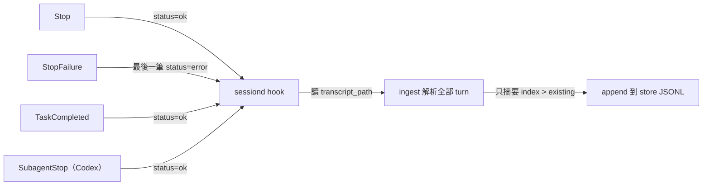

# Hook 事件與 Payload (Hook Events & Payloads)

`sessiond` 靠 agent 的 lifecycle hook 觸發。本檔記錄兩個 agent 提供哪些事件、每個事件的 stdin 帶什麼、以及 `sessiond` 實際註冊了哪些。

事件清單與欄位以 [Claude Code hooks 官方文件](https://code.claude.com/docs/en/hooks) 為準；觸發統計來自本機 `~/.claude/projects/` 實測。

## sessiond 註冊對照 (Registration Mapping)

| Agent | 設定檔 | 註冊事件 | 執行指令 |
| --- | --- | --- | --- |
| Claude Code | `<project>/.claude/settings.json` | `Stop`, `StopFailure`, `TaskCompleted` | `sessiond hook claude` |
| Codex | `<project>/.codex/config.toml` | `Stop`, `SubagentStop` | `sessiond hook codex` |

清單定義在 `pkg/sessiond/pkg/install/install.go`：

```go
var (
    claudeEvents = []string{"Stop", "StopFailure", "TaskCompleted"}
    codexEvents  = []string{"Stop", "SubagentStop"}
)
```

Claude 寫 JSON、Codex 寫 TOML；Codex 用 `# >>> superset sessiond hooks >>>` 與 `# <<< superset sessiond hooks <<<` 標記包住自有區塊，`uninstall` 靠這對標記精確移除。

### 事件 → sessiond 行為



四個事件走的是`同一條路徑`，唯一差別是 `hook.go` 對 `StopFailure` 把最後一筆 turn 標成 `status: "error"`。事件名本身寫進每筆 turn 的 `event` 欄位。

## 通用欄位 (Universal Fields)

每個 Claude hook 的 stdin 都有：

| 欄位 | 型別 | 說明 |
| --- | --- | --- |
| `session_id` | string | session UUID |
| `transcript_path` | string | transcript JSONL 絕對路徑 |
| `cwd` | string | 工作目錄 |
| `hook_event_name` | string | 事件名，等同 discriminator |

多數事件另外帶：

| 欄位 | 出現條件 |
| --- | --- |
| `prompt_id` | v2.1.196 以上 |
| `permission_mode` | `default` / `plan` / `acceptEdits` / `auto` / `dontAsk` / `bypassPermissions` |
| `effort` | `{"level": "low\|medium\|high\|xhigh\|max"}`，工具與 Stop 類事件 |
| `agent_id` / `agent_type` | 在 subagent 內執行時 |

## 事件全表 (All Events)

### 工具類 — 帶 tool 資料

| 事件 | 專屬欄位 | 何時觸發 |
| --- | --- | --- |
| `PreToolUse` | `tool_name`, `tool_input` | 工具執行前 |
| `PostToolUse` | `tool_name`, `tool_input`, `tool_output` | 工具成功後 |
| `PostToolUseFailure` | `tool_name`, `tool_input`, `error` | 工具失敗後 |
| `PostToolBatch` | `tool_results[]`（每筆含 `tool_name` / `tool_input` / `tool_output` / `error`） | 一批平行工具全部完成後 |
| `PermissionRequest` | `tool_name`, `tool_input` | 權限對話出現時 |
| `PermissionDenied` | `tool_name`, `tool_input`, `denial_reason` | auto 模式擋下時 |

`tool_input` 的形狀依工具而定：`Edit` / `Write` 給 `{"file_path": ...}`、`Bash` 給 `{"command": ...}`。這是唯一`不需解析 transcript`就能拿到檔案異動的管道。

### 對話類

| 事件 | 專屬欄位 | 何時觸發 |
| --- | --- | --- |
| `UserPromptSubmit` | `prompt` | 使用者送出 prompt，模型處理前 |
| `UserPromptExpansion` | `command`, `expanded_prompt` | slash command 展開時 |
| `Stop` | `last_assistant_message` | 模型回應完畢 |
| `StopFailure` | `error_type`, `error_message` | 因 API 錯誤結束該輪 |
| `SubagentStop` | `agent_type`, `agent_id`, `last_assistant_message`, `parent_agent_id` | subagent 結束 |
| `SubagentStart` | `agent_type`, `agent_id`, `parent_agent_id` | subagent 啟動 |
| `MessageDisplay` | `message_text` | assistant 文字顯示時 |

### session 生命週期

| 事件 | 專屬欄位 | matcher 可選值 |
| --- | --- | --- |
| `SessionStart` | `source`, `model`, `session_title`, `agent_type` | `startup` / `resume` / `clear` / `compact` |
| `SessionEnd` | `end_reason` | `clear` / `resume` / `logout` / `prompt_input_exit` / `bypass_permissions_disabled` / `other` |
| `Setup` | `agent_type` | `init` / `maintenance` |
| `PreCompact` | `trigger` | `manual` / `auto` |
| `PostCompact` | 無 | — |

### 環境與檔案

| 事件 | 專屬欄位 | 備註 |
| --- | --- | --- |
| `CwdChanged` | `previous_cwd`, `new_cwd` | `cd` 即觸發 |
| `FileChanged` | `file_path`, `change_type` | 需先由 `SessionStart` 回傳 `watchPaths` 註冊 |
| `InstructionsLoaded` | `load_reason`, `file_path`, `file_content` | CLAUDE.md 載入時給全文 |
| `ConfigChange` | `config_source`, `file_path`, `change_type` | settings.json 變動 |
| `WorktreeCreate` | `base_path`, `branch`, `tag` | 可覆寫 git 預設建立行為 |
| `WorktreeRemove` | `worktree_path` | session 結束或 subagent 完成時 |

### 任務與其他

| 事件 | 專屬欄位 |
| --- | --- |
| `TaskCreated` | `task_id`, `task_title`, `task_description` |
| `TaskCompleted` | `task_id`, `task_title` |
| `TeammateIdle` | `teammate_name` |
| `Notification` | `notification_type`, `message` |
| `Elicitation` | `server_name`, `form_schema`, `tool_name` |
| `ElicitationResult` | `server_name`, `action`, `content`, `tool_name` |

## 阻塞語意 (Blocking Semantics)

| 能力 | 事件 |
| --- | --- |
| 可阻塞（exit 2 或 `decision: "block"`） | `UserPromptSubmit` `UserPromptExpansion` `PreToolUse` `PermissionRequest` `PostToolUse` `PostToolUseFailure` `PostToolBatch` `Stop` `SubagentStop` `TaskCreated` `TaskCompleted` `TeammateIdle` `ConfigChange` `PreCompact` `Elicitation` `ElicitationResult` |
| 完全忽略 exit code | `StopFailure` `PermissionDenied` `InstructionsLoaded` |
| 非阻塞錯誤（僅顯示 stderr） | `SessionEnd` `PostCompact` `Notification` `CwdChanged` `FileChanged` `MessageDisplay` |

`Stop` 屬於可阻塞事件：exit 2 會讓對話`繼續`而非結束。這是 `pkg/sessiond/pkg/hook/hook.go` 堅持「always returns nil」的原因 — 一個失敗的 telemetry hook 絕不能把使用者的 session 卡住。

## 本機觸發統計 (Observed Frequency)

跨 `~/.claude/projects/` 全部 transcript 的 `attachment.hookEvent` 統計：

| 事件 | 次數 |
| --- | --- |
| `PostToolUse` | 15,863 |
| `PreToolUse` | 3,454 |
| `SessionStart` | 1,124 |
| `Stop` | 678 |
| `UserPromptSubmit` | 1 |

`PostToolUse` 的觸發量是 `Stop` 的約 23 倍。任何掛在 `PostToolUse` 上的 hook 都要按「每次工具呼叫都跑一次 process」評估成本。

## Codex 事件 (Codex Events)

Codex 的 hook 設定寫在 `.codex/config.toml`：

```toml
# >>> superset sessiond hooks >>>
[[hooks.Stop]]
[[hooks.Stop.hooks]]
type = "command"
command = "/Users/shuk/.local/go/bin/sessiond hook codex"

[[hooks.SubagentStop]]
[[hooks.SubagentStop.hooks]]
type = "command"
command = "/Users/shuk/.local/go/bin/sessiond hook codex"
# <<< superset sessiond hooks <<<
```

Codex hook 期望 stdout 回一行 JSON：

```json
{"continue": true}
```

`writeResponse` 只對 `agent == "codex"` 輸出這一行；Claude 接受空 stdout。這行必須在任何 early return 之前寫出，否則 Codex 端會視為異常。

## hookpayload 解析的 union (Parsed Union)

`pkg/sessiond/pkg/hookpayload/payload.go` 定義的容忍式 union：

| 欄位 | JSON key | 官方 schema 對應 | 使用情況 |
| --- | --- | --- | --- |
| `SessionID` | `session_id` | ✅ 通用欄位 | 使用中 |
| `TranscriptPath` | `transcript_path` | ✅ 通用欄位 | 使用中 |
| `Cwd` | `cwd` | ✅ 通用欄位 | 使用中 |
| `HookEventName` | `hook_event_name` | ✅ 通用欄位 | 使用中，寫入 `turn.event` |
| `TurnID` | `turn_id` | ⚠️ 查無對應 | 寫入 `turn.turn_id`，實際可能永遠為空 |
| `Model` | `model` | ⚠️ 僅 `SessionStart` 有 | 解析但未使用 |
| `LastAssistantMsg` | `last_assistant_message` | ✅ `Stop` / `SubagentStop` | 解析但`未使用` |
| `AgentTranscriptPath` | `agent_transcript_path` | ⚠️ 查無對應 | 解析但未使用 |

三個標 ⚠️ 的欄位在官方文件中查不到；`agent_transcript_path` 的功能等價物應是 `SubagentStop` 的 `agent_id`。這些欄位不會造成錯誤（`encoding/json` 忽略缺欄），但屬於未驗證假設。

## `last_assistant_message` 的語意

`不是`摘要，是模型該輪最後一則訊息的`逐字全文`。

| 面向 | 事實 |
| --- | --- |
| 內容 | 逐字原文，非壓縮、非改寫 |
| 範圍 | 只有`最後一則`，不含該輪中間的 assistant 訊息 |
| 產生者 | agent runtime 從自己的訊息緩衝取出，非額外呼叫模型 |
| 成本 | 零，不是 provider 端的額外推論 |

Codex 的對等欄位 `event_msg/task_complete.last_agent_message` 已在本機 rollout 實測確認：內容是完整的多段 markdown 回覆全文（含 heading、清單、程式碼區塊），與 TUI 上顯示的最終回覆逐字相同。

### 與 transcript 的對應關係

`last_assistant_message` 等同 transcript 中`該輪最後一筆` `stop_reason` 為 `end_turn` 或 `stop_sequence` 的 assistant record 的 `text` block 內容。詳細鑑別方式見 [`claude-transcript.md`](claude-transcript.md) 的「`stop_reason` 是最終回覆的鑑別欄位」。

換言之，透過 hook 拿 `last_assistant_message` 與自行解析 transcript 取 `end_turn` 記錄，`結果應一致`；差別只在前者不需要開檔解析。

### 「只有最後一則」的限制

一輪若包含多次工具呼叫，模型在工具之間輸出的說明文字都`不在`這個欄位裡。跨 120 個 transcript 實測，這類中間訊息的數量是最終訊息的約 `7 倍`（2,067 對 295+55）。

這正是 `sessiond` 不用它、改回頭讀 `transcript_path` 的原因 — `ingest` 需要把整輪所有 assistant text 串接起來才能餵給摘要器。

反過來說，若日後判定摘要只需要最終回覆而不需要過程，直接用 `last_assistant_message` 就能省掉整個 transcript 解析路徑。這是目前 `hookpayload` 已解析卻未使用該欄位的潛在價值。

## 未採用的機會 (Unused Opportunities)

| 事件 / 欄位 | 能提供什麼 | 目前狀態 |
| --- | --- | --- |
| `PostToolUse.tool_input` | 檔案異動路徑、執行的指令 | 未註冊此事件 |
| `PostToolBatch.tool_results[]` | 一批工具一次拿齊，比 `PostToolUse` 省 process | 未註冊 |
| `SessionStart.session_title` | 現成 session 標題 | 未註冊 |
| `SessionEnd.end_reason` | session 收尾與最終彙整時機 | 未註冊 |
| `UserPromptSubmit.prompt` | 不需解析 transcript 就拿到 prompt | 未註冊 |
| `Stop.last_assistant_message` | 該輪最終回覆全文 | 已解析但未使用 |
| `CwdChanged.new_cwd` | 跨資料夾移動軌跡 | 未註冊 |

要做「資料夾進度追蹤」有兩條路：

| 路徑 | 做法 | 取捨 |
| --- | --- | --- |
| A. 續用 `Stop` + 補 transcript 解析 | 在 `ingest/claude.go` 加 `tool_use` / `tool_result` 萃取 | 每輪一次，成本低；需自行用 `tool_use_id` 配對 |
| B. 加註冊 `PostToolUse` | stdin 直接給 `tool_name` + `tool_input` + `tool_output` | 資料現成、即時；但依實測是每輪約 23 倍的 process 啟動量 |

以本機統計評估，`A` 的成本效益明顯較佳；`B` 只在需要即時性時才值得，且應改掛 `PostToolBatch` 以攤平 process 啟動成本。
